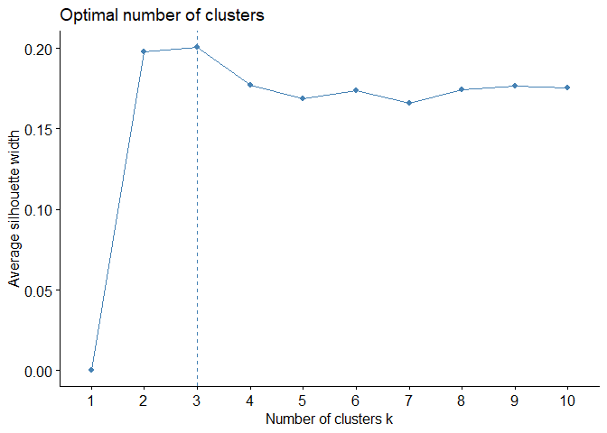

## Load Dataset

The necessary libraries and the wine dataset are loaded.

    library(tidyverse)

    ## ── Attaching core tidyverse packages ──────────────────────── tidyverse 2.0.0 ──
    ## ✔ dplyr     1.1.4     ✔ readr     2.1.5
    ## ✔ forcats   1.0.0     ✔ stringr   1.5.1
    ## ✔ ggplot2   3.5.1     ✔ tibble    3.2.1
    ## ✔ lubridate 1.9.3     ✔ tidyr     1.3.1
    ## ✔ purrr     1.0.2     
    ## ── Conflicts ────────────────────────────────────────── tidyverse_conflicts() ──
    ## ✖ dplyr::filter() masks stats::filter()
    ## ✖ dplyr::lag()    masks stats::lag()
    ## ℹ Use the conflicted package (<http://conflicted.r-lib.org/>) to force all conflicts to become errors

    data_url <- 'https://raw.githubusercontent.com/koimabrian/Datasets/refs/heads/main/Wine.csv'
    Wine <- read.csv(data_url, comment = "#")  # Handle potential comments in the CSV
    head(Wine)

    ##   Obs   Rating    Price   Alcohol Residual_Sugar  Sulphates       pH Country
    ## 1   1 66.09628 42.35785 12.884478       1.723964 1.82236164 3.094826   Italy
    ## 2   2 26.29778 18.07262 10.788513       2.717204 1.25833852 3.687788  Canada
    ## 3   3 57.55450 27.33195  9.836948       1.412335 0.02351161 3.463087  Canada
    ## 4   4 46.55640 22.75134 12.022274       3.068457 1.79914031 1.544849   Italy
    ## 5   5 49.40503 14.39930 11.442785       2.994345 1.06218391 3.032852  France
    ## 6   6 41.32942 18.01701 11.667942       1.631718 0.85062170 2.191800  Canada

## Standardize Continuous Variables

The continuous variables (excluding observation number and country) are
scaled.

    data <- Wine %>% select(-Obs, -Country) %>% scale()

## Create Clusters with K-Means

The k-means algorithm is applied to the standardized data, setting the
number of clusters to 3.

    kmeans_result <- kmeans(data, centers = 3, iter.max = 100, nstart = 100)
    kmeans_result

    ## K-means clustering with 3 clusters of sizes 43, 25, 32
    ## 
    ## Cluster means:
    ##          Rating       Price    Alcohol Residual_Sugar  Sulphates          pH
    ## 1 -0.7611830170 -0.74488647 -0.3311789    -0.48277078 -0.1169446  0.37747968
    ## 2  0.0005649203 -0.09531108  0.7695537     0.73705964  0.7738343 -0.71133001
    ## 3  1.0223983350  1.07540297 -0.1561923     0.07289539 -0.4474138  0.04848825
    ## 
    ## Clustering vector:
    ##   [1] 3 1 1 2 1 1 2 2 3 3 1 1 1 1 1 3 3 1 1 1 2 2 3 3 1 1 3 2 1 3 1 3 3 2 3 1 3
    ##  [38] 2 3 1 1 1 3 1 2 3 1 1 3 3 2 2 1 3 1 1 3 2 1 1 2 1 3 2 3 3 3 2 1 1 1 1 1 2
    ##  [75] 3 1 1 2 2 1 1 3 2 2 1 3 1 2 2 2 3 1 2 3 3 3 3 1 2 1
    ## 
    ## Within cluster sum of squares by cluster:
    ## [1] 156.1271 114.3882 119.1354
    ##  (between_SS / total_SS =  34.4 %)
    ## 
    ## Available components:
    ## 
    ## [1] "cluster"      "centers"      "totss"        "withinss"     "tot.withinss"
    ## [6] "betweenss"    "size"         "iter"         "ifault"

## Determine the Optimal Number of Clusters

To identify the optimal number of clusters, the within-cluster sum of
squares (WSS), silhouette method, and gap statistic are visualized.

    library(factoextra)
    # WSS plot
    fviz_nbclust(data, kmeans, method = "wss")

    # Silhouette plot
    fviz_nbclust(data, kmeans, method = "silhouette")

    # Gap statistic
    fviz_nbclust(data, kmeans, method = "gap_stat")

## Cluster Visualization

Clusters are visualized in a biplot, and then plotted using the original
variables (Rating vs Price).

    # Cluster biplot
    fviz_cluster(kmeans(data, centers = 3, iter.max = 100, nstart = 100), data = data)

### Clusters with Original Variables

Cluster labels are added to the original dataset, and clusters are
visualized using the Rating and Price variables.

    clusters <- kmeans(data, centers = 3, iter.max = 100, nstart = 100)
    Wine <- Wine |> mutate(cluster = clusters$cluster)

    # Plot clusters using Rating and Price
    Wine |> ggplot(aes(x = Rating, y = Price, col = as.factor(cluster))) + 
      geom_point() + 
      labs(title = "Wine Clusters by Rating and Price", color = "Cluster")

